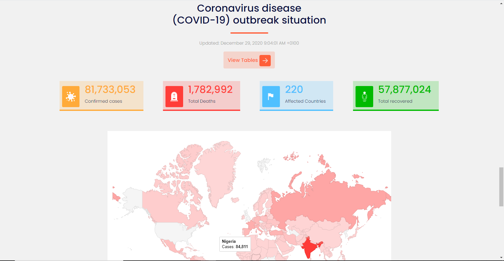
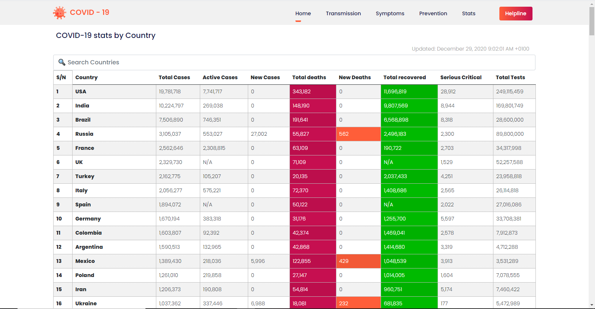

# React - Covid

Basic nformation on covid-19, which includes mode of transmission, symptoms, prevention and realtime statistics of covid-19 for all affected countries across the world

## View Website

The app is hosted on netlify, see link below
[View](https://kovid-app.netlify.app/)

## Credits:
- API used - [Coronavirus monitor](https://rapidapi.com/astsiatsko/api/coronavirus-monitor)
- Map - [React Google Charts](https://react-google-charts.com/)
- Time formatting - [Moment.js](https://momentjs.com/)
- Figures count animation - [React CountUp](https://www.npmjs.com/package/react-countup)
- Illustrations - [Undraw](https://undraw.co/)
- Icons - [Flat Icons](https://www.flaticon.com/)

## Like what you see?

Please leave a star on our GitHub repo!

## Find me on 
- [Twitter](https://twitter.com/lollykrown)
- [Website](https://lollykrown.xyz)

